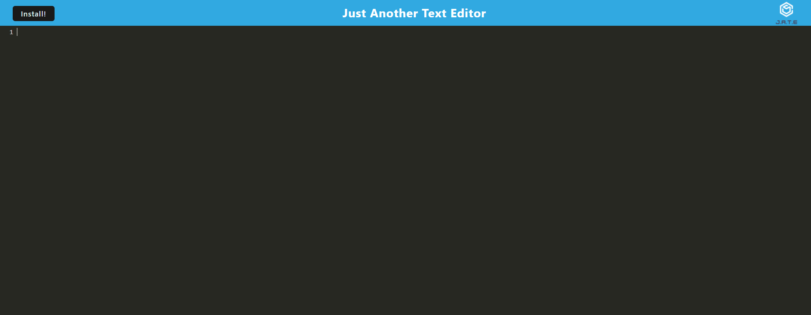

## PWA-Challenge-Text-Editor

This is a text editor web app that works without an internet connection. It uses IndexedDB to store your notes or code snippets locally. Built as a Progressive Web Application (PWA), it stays reliable and accessible even when you're offline.

## Features
Offline Functionality: Edit and save notes or code snippets even without an internet connection.
IndexedDB Integration: Utilizes idb for storing and retrieving data locally in the browser.
Service Worker: Implements Workbox to cache static assets and ensure offline access.
Webpack Bundling: JavaScript files are bundled using Webpack with support for modern JavaScript features via Babel.
Manifest: Generated manifest.json enables installation and provides app metadata.

## Deployment
The application is deployed on Render [and can be accessed live at Live Demo](https://pwa-challenge-text-editor.onrender.com/). 

## Installation
To run this application locally:

Clone this repository.
Install dependencies using npm install.
Start the application using npm run start.
Open your browser and navigate to http://localhost:3000.

## Usage
Start typing to create or edit text.
Content is automatically saved to IndexedDB when the editor window loses focus.
Install the application as a PWA by clicking the Install button in the browser.

## Technologies Used
Frontend: HTML, CSS, JavaScript
Backend: Node.js, Express.js
IndexedDB for data storage
Webpack for bundling
Workbox for service worker management

## Resources 
xpert, activites from class

## License
The code in this project is licensed under the MIT License.

## contact

https://github.com/yvonneewa

## Screenshots

